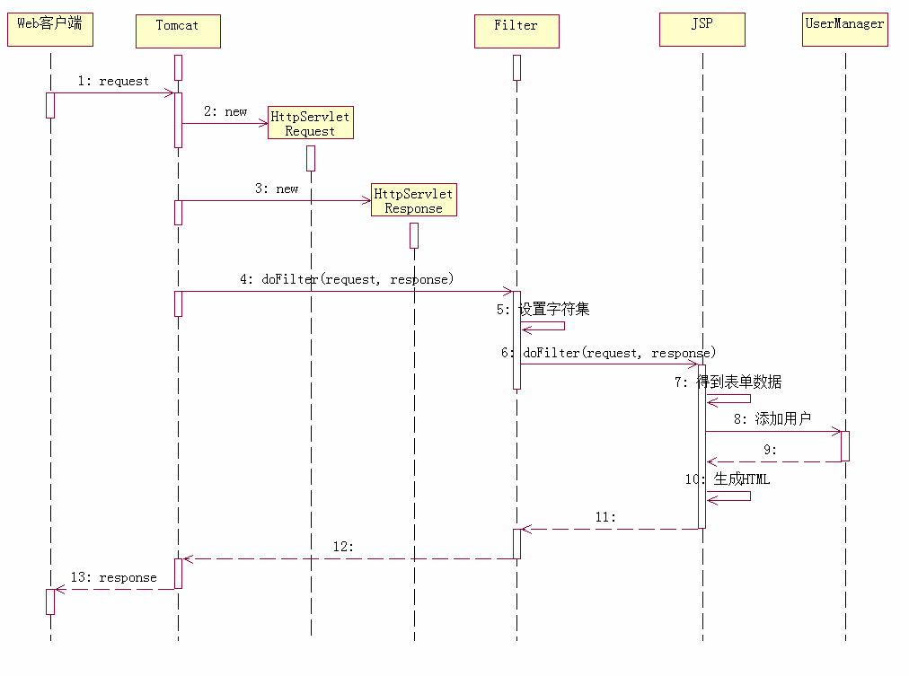

**AOP**（Aspect-Oriented Programming，面向切面编程）是一种编程思想，并不是一种具体的实现，谈到实现一般有Filter和代理模式两种常见的使用方式。

Spring中的AOP也是封装代理模式完成的，可以说是**OOP**（Object-Oriented Programing，面向对象编程）的补充和完善。OOP利用封装、继承和多态把一切事物打造成对象结构，但是对于所有对象中都存在的一些公共行为，OOP就显得无能为力，也就是说OOP允许你定义从上到下的关系，但并不适合定义从左到右的关系。抽象和接口虽好，但对所有不相干的对象建立共同的接口或父类未免有些生硬，例如日志功能，日志代码几乎散布在所有的对象层次中，而它和散布到对象的核心功能毫无关系，对于其他类型的代码，如安全性、异常处理和透明的持续性也是如此。因此，为减少这种大量的重复代码，面向切面技术诞生了，AOP和OOP的关系好似JSP和Servlet的关系，以此之长，补彼之短。

**Java**中常见的AOP技术有两个，分别是Filter和代理模式（也可以称为过滤器和拦截器），Filter是基于回调函数，代理模式是基于Java反射技术，代理模式又分为静态代理和动态代理，动态代理就是拦截器的简单实现。他们各自实现的功能不同，原理如出一辙。如上图，以添加用户为例，采用Module1架构模式，从图中可以看出无论程序从左向右或者从右向左执行都必须经过Filter，Filter在Request到达JSP（Servlet）前截获Request并进行预处理，也可以在Response离开JSP（Servlet）时处理Response，然后对Request进行统一的设置后继续向后传递，比如可以在Filter完成字符集的设置，用户身份的识别，敏感词汇的过滤等等，配置Filter个数不限。

**Filter**是职责链模式的经典应用，从上面示例代码可以看出，实现了Filter接口的doFilter方法主要用于截获Request对象，把截获的请求处理后（设置字符集），调用FilterChain 接口的chain.doFilter(request,response)方法，把处理权传递给下一个filter。

其中，FilterChain维护了一个链表，链表中存放着配置对象的链条，每次用户调用 一次chain.doFilter(request, response)，链表就去取下一个配置对象，再通过配置对象 得到下一个filter，然后调用该filter，接着在filter里写的逻辑就被执行了。