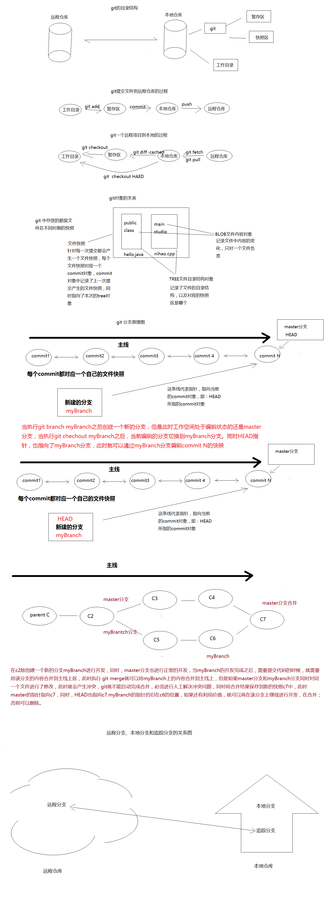

**版本冲突的形成：**
对于同一个文件来说，当两个以上的用户在同一个版本下对文件进行了修改，在提交的时候就会发生版本的冲突。例如：

假设A、B两个用户都在版本号为100的时候，更新了kingtuns.txt这个文件，A用户在修改完成之后提交kingtuns.txt到服务器，这个时候提交成功，这个时候kingtuns.txt文件的版本号已经变成101了。同时B用户在版本号为100的kingtuns.txt文件上作修改，修改完成之后提交到服务器时，由于不是在当前最新的101版本上作的修改，所以导致提交失败。
**GIT常用命令原理图：**
