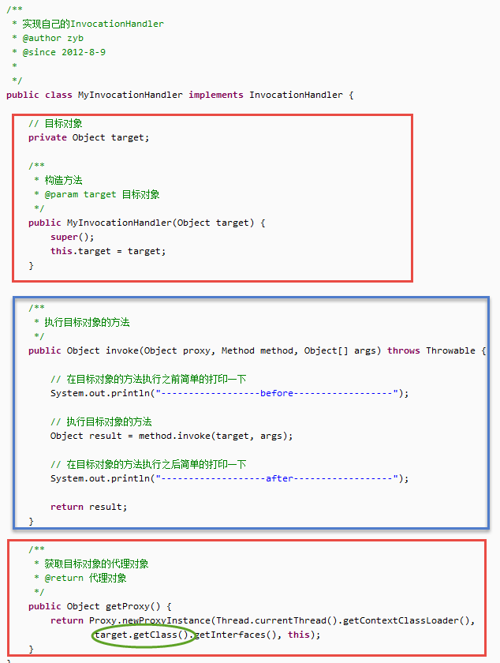
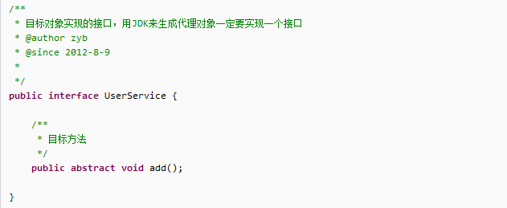
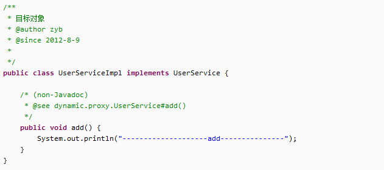
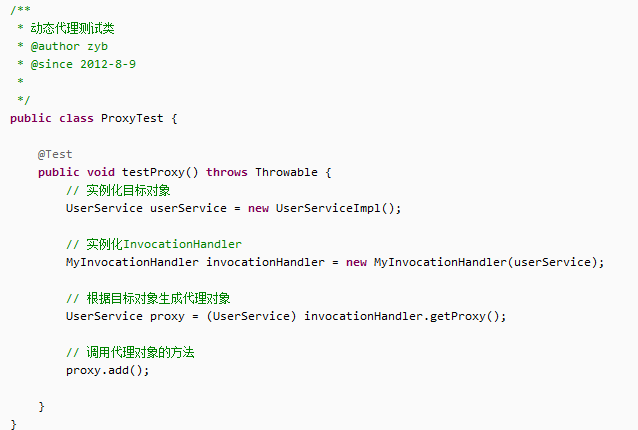

&emsp;&emsp;JDK动态代理是对对象做代理,需要获取到被代理的对象,同时要求被代理对象的类要实现接口然后通过proxy.newProxyInstance()创建代理对象, 代理对象调用invaoke()方法达到动态代理效果。
#### 代理类的编写

#### 目标对象(被代理对象)实现的接口定义

#### 目标对象类(被代理类)

#### 动态代理的测试类

#### 总结:
1.自定义MyinvacationHandler实现InvacationHandler接口,构造方法接收被代理对象
2.实现invoke方法AOP思想
3.获取proxy代理对象,proxy.newProxyInstance()
