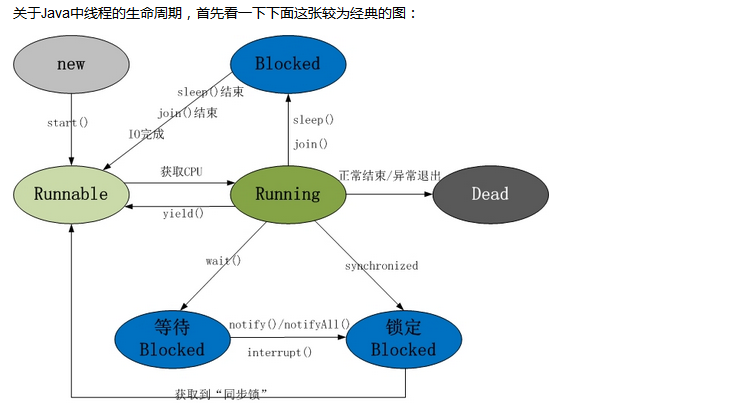

#### 进程与线程的概念理解:

	进程:执行的应用程序.
	线程:程序执行的一条路径

#### 线程的生命周期以及五中状态

#### Java线程具有五中基本状态

**新建状态（New）**：当线程对象对创建后，即进入了新建状态，如：Thread t = new MyThread();

**就绪状态（Runnable）**：当调用线程对象的start()方法（t.start();），线程即进入就绪状态。处于就绪状态的线程，只是说明此线程已经做好了准备，随时等待CPU调度执行，并不是说执行了t.start()此线程立即就会执行；

**运行状态（Running）**：当CPU开始调度处于就绪状态的线程时，此时线程才得以真正执行，即进入到运行状态。注：就     绪状态是进入到运行状态的唯一入口，也就是说，线程要想进入运行状态执行，首先必须处于就绪状态中；

**阻塞状态（Blocked）**：处于运行状态中的线程由于某种原因，暂时放弃对CPU的使用权，停止执行，此时进入阻塞状态，直到其进入到就绪状态，才 有机会再次被CPU调用以进入到运行状态。根据阻塞产生的原因不同，阻塞状态又可以分为三种：

	1.等待阻塞：运行状态中的线程执行wait()方法，使本线程进入到等待阻塞状态；

	2.同步阻塞 -- 线程在获取synchronized同步锁失败(因为锁被其它线程所占用)，它会进入同步阻塞状态；

	3.其他阻塞 -- 通过调用线程的sleep()或join()或发出了I/O请求时，线程会进入到阻塞状态。当sleep()状态超时、join()等待线程终止或者超时、或者I/O处理完毕时，线程重新转入就绪状态。

**死亡状态（Dead）**：线程执行完了或者因异常退出了run()方法，该线程结束生命周期。

#### java中线程创建的几种形式

1.继承Thread类,重写run方法
          
	 class MyThread extends Thread {
	      private int i = 0;
	      @Override
	      public void run() {
		  for (i = 0; i < 100; i++) {
		      System.out.println(Thread.currentThread().getName() + " " + i);
		 }
	     }
	 }

     
	public class ThreadTest {

	    public static void main(String[] args) {
		for (int i = 0; i < 100; i++) {
		    System.out.println(Thread.currentThread().getName() + " " + i);
		    if (i == 30) {
		        Thread myThread1 = new MyThread();     // 创建一个新的线程  myThread1  此线程进入新建状态
		        Thread myThread2 = new MyThread();     // 创建一个新的线程 myThread2 此线程进入新建状态
		        myThread1.start();                     // 调用start()方法使得线程进入就绪状态
		        myThread2.start();                     // 调用start()方法使得线程进入就绪状态
		    }
		}
	    }
	}

2.实现runnable接口,重写run方法

	class MyRunnable implements Runnable {
	    private int i = 0;

	    @Override
	    public void run() {
		for (i = 0; i < 100; i++) {
		    System.out.println(Thread.currentThread().getName() + " " + i);
		}
	    }
	}

	public class ThreadTest {

	    public static void main(String[] args) {
		for (int i = 0; i < 100; i++) {
		    System.out.println(Thread.currentThread().getName() + " " + i);
		    if (i == 30) {
		        Runnable myRunnable = new MyRunnable(); // 创建一个Runnable实现类的对象
		        Thread thread1 = new Thread(myRunnable); // 将myRunnable作为Thread target创建新的线程
		        Thread thread2 = new Thread(myRunnable);
		        thread1.start(); // 调用start()方法使得线程进入就绪状态
		        thread2.start();
		    }
		}
	    }
	}

理解ThreadLocal:
ThreadLocal叫做 线程局部变量,
1、每个线程都有自己的局部变量

    每个线程都有一个独立于其他线程的上下文来保存这个变量，一个线程的本地变量对其他线程是不可见的（有前提，后面解释）

2、独立于变量的初始化副本

    ThreadLocal可以给一个初始值，而每个线程都会获得这个初始化值的一个副本，这样才能保证不同的线程都有一份拷贝。

3、状态与某一个线程相关联
    ThreadLocal 不是用于解决共享变量的问题的，不是为了协调线程同步而存在，而是为了方便每个线程处理自己的状态而引入的一个机制，理解这点对正确使用ThreadLocal至关重要。

ThreadLocal实现机制

	/**1、每个Thread对象内部都维护了一个ThreadLocalMap这样一个ThreadLocal的Map，可以存放若干个ThreadLocal。

	ThreadLocal.ThreadLocalMap threadLocals = null;
	2、当我们在调用get()方法的时候，先获取当前线程，然后获取到当前线程的ThreadLocalMap对象，如果非空，那么取出ThreadLocal的value，否则进行初始化，初始化就是将initialValue的值set到ThreadLocal中。**/

	public T get() {
	    Thread t = Thread.currentThread();
	    ThreadLocalMap map = getMap(t);
	    if (map != null) {
		ThreadLocalMap.Entry e = map.getEntry(this);
		if (e != null)
		    return (T)e.value;
	    }
	    return setInitialValue();
	}

　事实上，从本质来讲，就是每个线程都维护了一个map，而这个map的key就是threadLocal，而值就是我们set的那个值，每次线程在get的时候，都从自己的变量中取值。