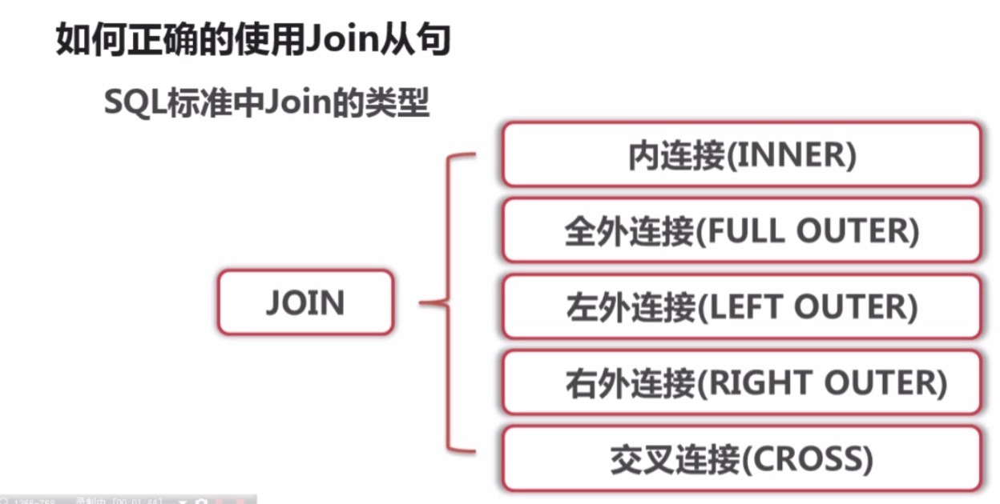
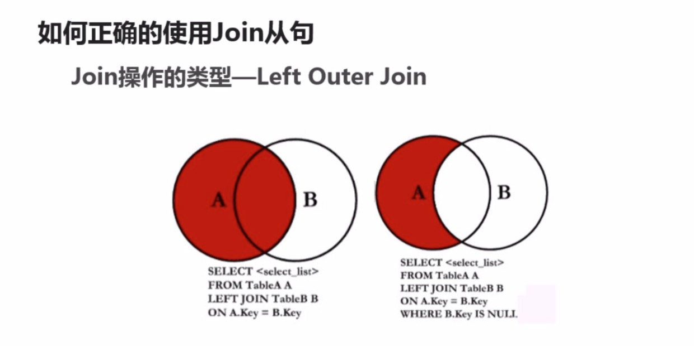
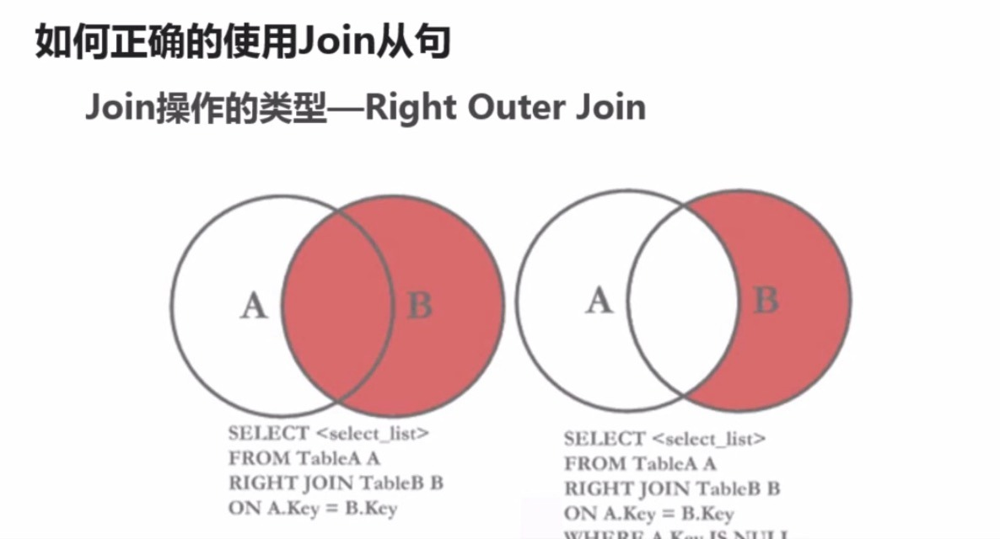
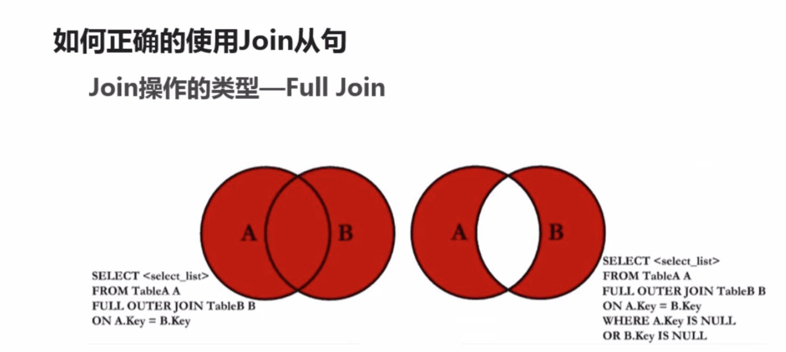
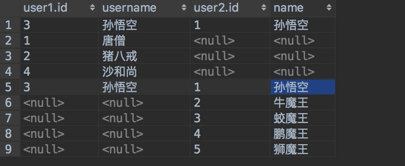

#### 数据表结构

**表结构一:**

**表结构二:**

**Join从句的分类:**

#### Inner join
inner join表示将两张表进行关联起来,查询里面的交集部分

	SELECT * FROM user1 INNER JOIN user2 WHERE user1.username = user2.name;
**查询结果: **
当查询*的时候是将两张表进行拼接起来

**左外链接用途**

左外链接一般查询的是左表的所有和右表所匹配的数据,匹配不上的全是null

	SELECT * FROM user1 LEFT JOIN user2 on user1.username = user2.name
**查询结果:**

查询只存在于左表中的数据

	SELECT * FROM user1 LEFT JOIN user2 on user1.username = user2.name WHERE user2.name IS NOT NULL
**查询结果:**

#### 右外链接

右外链接和左外链接是相对的,只不过是以右表为基准

#### 全连接

全连接表示可以查询出两个表所有的数据或两个表交集之外的数据

**代码演示:**

	SELECT * FROM user1  LEFT JOIN user2 ON user1.username = user2.name UNION ALL SELECT *  FROM user1 RIGHT JOIN user2 ON user1.username = user2.name
**查询结果:**

