**前言：**
&emsp;&emsp;上海百联大宗内部员工培训系统是为了给内部员工提供一个高素质培训平台，也是百联研发部新技术实验平台。该系统前期采用的是Vertx作为系统框架，以Kotlin作为开发语言，以Vue作为前台框架。将来还会有更多的新技术应用于该平台。作为平台的开发人员，为了满足开发的需求，所以学习了Kotlin, 现将基本语法整理出来供大家学习，同时也便于日后查看。
#### 空类型用法：
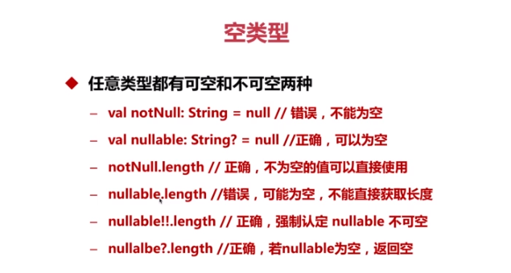
as : 类型转换关键字/包别名 
安全类型转换: 
智能类型转换: 
#### 区间:
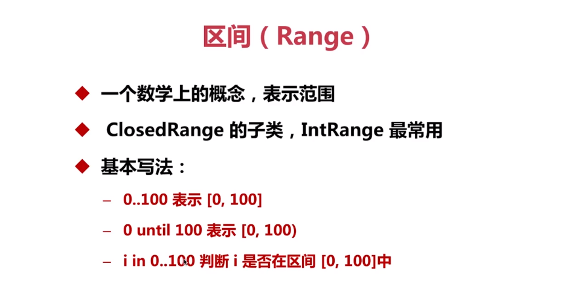
#### 数组的使用方法
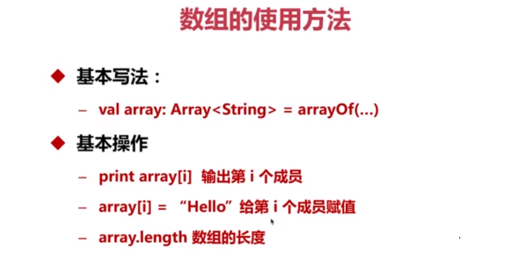
#### 基本数据类型的数组
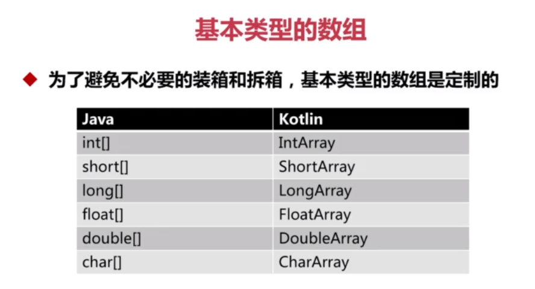
#### 常量与变量
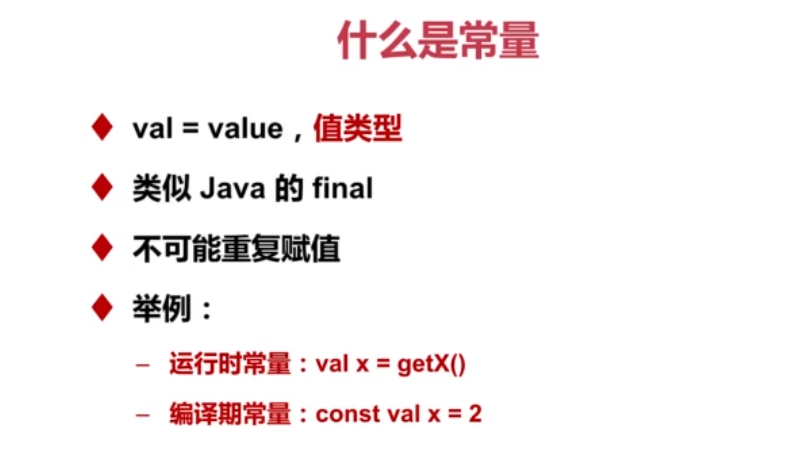
#### Lamd表达式
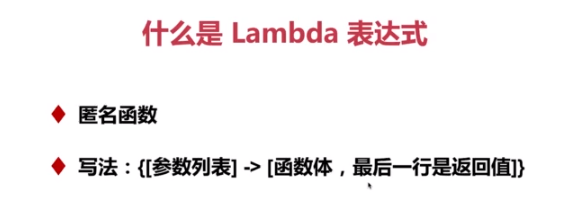
#### Lamd表达式参数传递
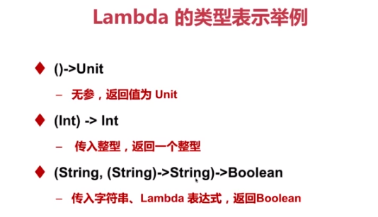
#### 成员变量和局部变量的定义和区别：
成员变量都是用val或var修饰的，而没有被这两个关键字修饰的变量都是局部变量
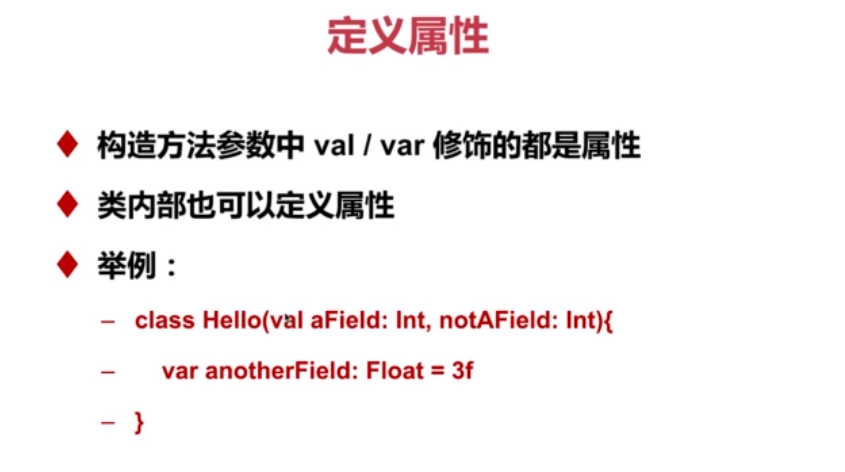
#### 变量的初始化
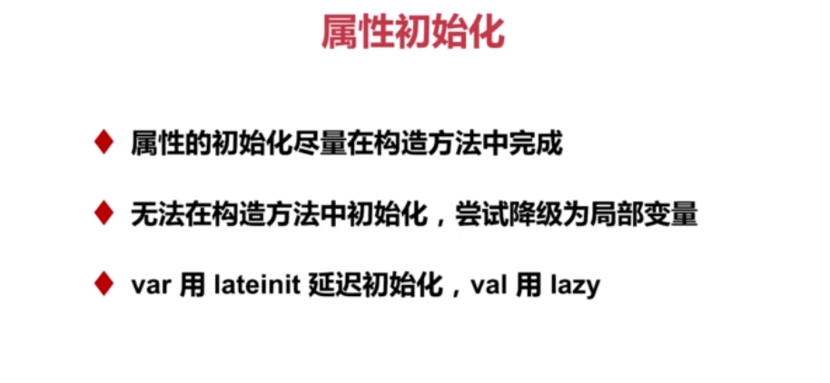
#### 成员变量的访问控制
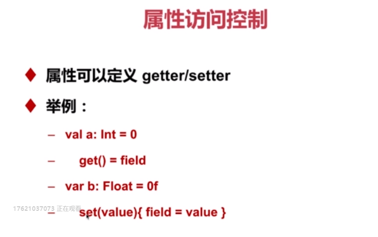
#### 运算符的定义
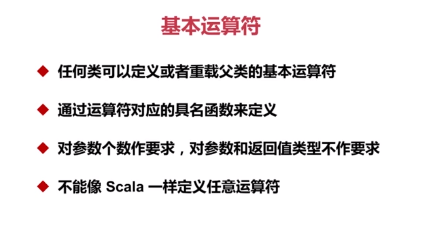
#### Kotlin关键字：

**operator:**定义运算符
**infix:**定义中缀表达式
**override:**重写父类方法
**constructor:**构造器
**const:**定义编译期常量
**val:**定义普通成员常量
**var:**定义成员变量

**注意：**

1. 在Kotlin中when，if语句和Lamda表达式一样具有返回值，返回值为最后一行的值

2. 在Kotlin中默认的类和方法都是final的，要继承重写必须用关键字open，或者设置成abstract类型，重写方法必须使用override关键字

#### if表达式
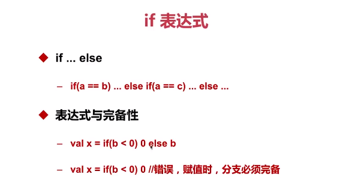
#### when、continue 和 break
when表达式，Java中switch的替代品, 循环关键字continue和break
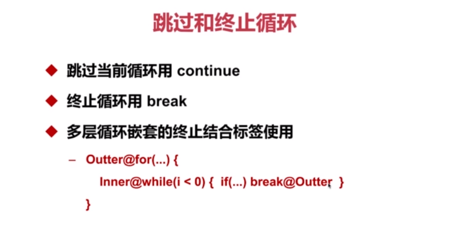
#### 具名参数
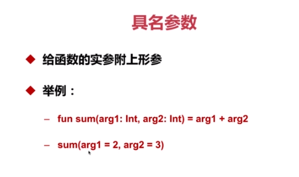
#### 变长参数
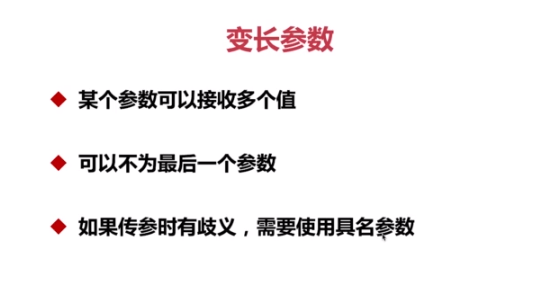
#### Sperat Operator
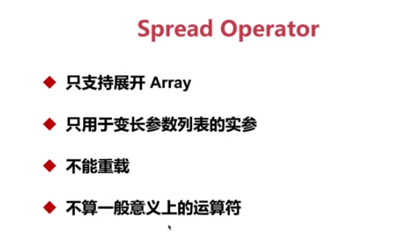
#### 默认参数
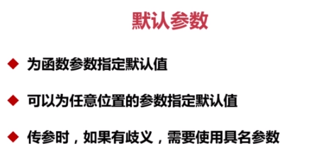
#### 继承和实现
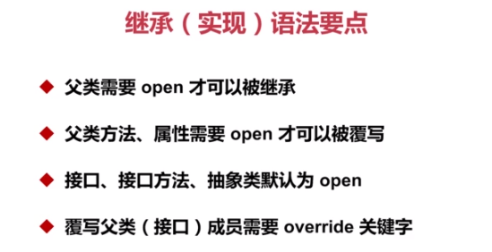
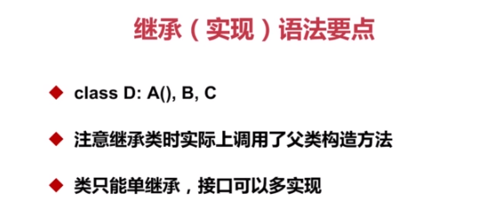
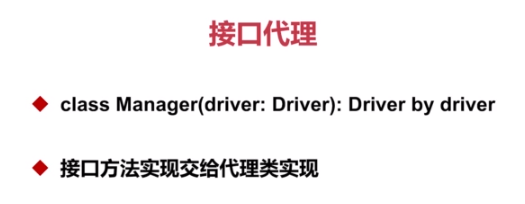
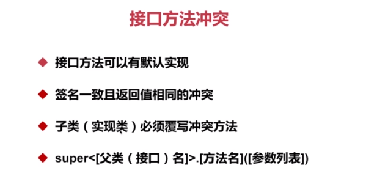
#### object
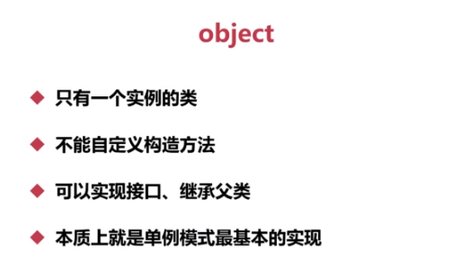
#### 静态方法的定义
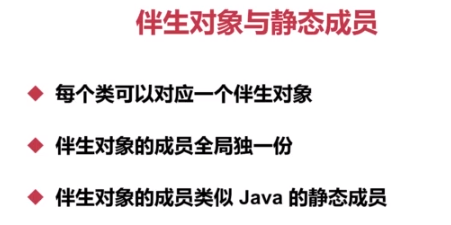
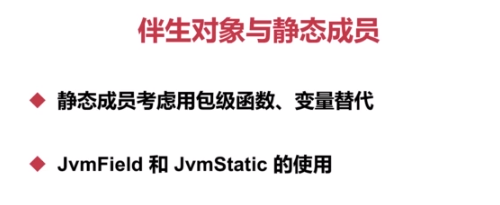

**方法签名：**这是一个JVM概念，虚拟机根据方法签名来判断方法的唯一性，从而会存在方法的重载。方法返回值不属于方法签名

lamd表达式是一种匿名函数

