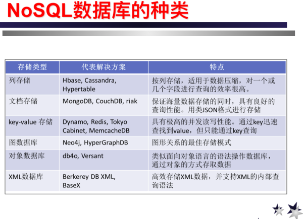

#### 关于NoSQL(NoSQL is Not Only SQL)
NoSQL出现的背景大概是因为随着数据量的扩大，在一些对数据集的分析中，传统的关系型数据库的计算成本变得很大。NoSQL凭借着它高大上的“易扩展、大数据、高可用、高性能、灵活性”，强势登场。
#### 关于NoSQL的种类

#### 区别和特点
1. HBase（列存储）
两大用途：
特别适用于简单数据写入（如“消息类”应用）和海量、结构简单数据的查询（如“详单类”应用）。特别地，适合稀疏表。（个人觉得存个网页内容是极好极好的）
作为MapReduce的后台数据源，以支撑离线分析型应用。
场景：Facebook的消息类应用，包括Messages、Chats、Emails和SMS系统，用的都是HBase；淘宝的WEB版阿里旺旺，后台是HBase；小米的米聊用的也是HBase；移动某省公司的手机详单查询系统。（单次分析，只能scan全表或者一个范围内的）
2. MongoDB
是一个介于关系型和非关系型之间的一个产品吧，类SQL语言，支持索引
MongoDb在类SQL语句操作方面目前比HBase具备更多一些优势，有二级索引，支持相比于HBase更复杂的集合查找等。
BSON的数据结构使得处理文档型数据更为直接。支持复杂的数据结构
MongoDb也支持mapreduce，但由于HBase跟Hadoop的结合更为紧密，Mongo在数据分片等mapreduce必须的属性上不如HBase这么直接，需要额外处理。
3. Redis
Redis为内存型KV系统，处理的数据量要小于HBase与MongoDB
Redis很适合用来做缓存，但除此之外，它实际上还可以在一些“读写分离”的场景下作为“读库”来用，特别是用来存放Hadoop或Spark的分析结果。
Redis的读写性能在100,000 ops/s左右，时延一般为10～70微妙左右；而HBase的单机读写性能一般不会超过1,000ops/s，时延则在1～5毫秒之间。
Redis的魅力还在于它不像HBase只支持简单的字符串，他还支持集合set，有序集合zset和哈希hash