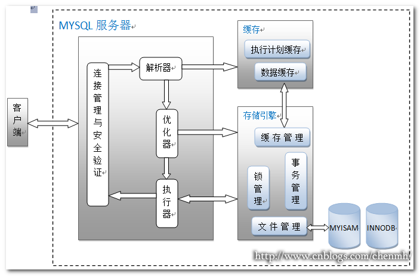

#### MySql系统架构图

**MySql系统简介：**
MySql系统的架构如上图所示，现在就图中的每个模块进行简单说明。

- 客户端：
指的是MySql驱动或者命令行客户端，任何MySql用户都可以通过这种方式连接到MySql数据库。
- 连接管理与安全验证
	1. 每个使用MySql数据库的用户都必须通过客户端工具连接到数据库之后才能使用数据库。而数据库并不能随便让任何人都能连接的上，所以，只有具备权限的用户才能正常连接到数据库。
	2. 每次连接到数据库的时候都需要创建一个连接，使用完成之后有得销毁该连接释放系统资源，从而完成一次数据库的访问。对于复杂的业务而言，可能需要频繁的连接数据库，因此会存在频繁的创建连接和销毁连接操作，而这些操作同样会造成系统资源的大量消耗，因此需要对连接进行管理。
	
	连接管理与安全验证这个模块的作用就是为了解决上述两个问题的。

	1. 当用户尝试连接到数据库的时候需要通过用户名、密码、主机IP、数据库名称等信息进行进行验证，只有通过验证的用户才能连接到数据库。
	2. 为了避免多次频繁创建、销毁连接带来的系统资源浪费，通常会采用连接池的方式来缓存连接对象。常用到的连接池有C3P0连接池和、Druid连接池。

- 解析器
解析器的作用是对SQL语句进行解析生成[解析树][1]，以便于后续优化器进行优化。当用户连接到数据库之后，解析器会拿到用户需要执行的SQL语句，然后到缓存器中去查询是否存在该SQL语句，如果存在，直接返回该条SQL上次的执行结果。反之，会检查该SQL语句中是否存在语法错误，根据检查结果决定是否生成解析树。
- 优化器
优化器主要是对查询进行优化。优化器拿到解析器生成的解析树之后会对解析后的SQL语句进行分析，根据表的索引，数据的读取方式，确定出多种查询方法。然后通过存储引擎获取这些查询方法相关的大致数据和统计信息，从而计算每种查询方法的开销信息，然后从多种查询方式中确定出开销最小的一种查询方法。

- 执行器
执行器根据优化后的SQL语句生成执行计划，执行查询语句，返回查询结果。
- 缓存器
对执行查询语句及查询结果进行缓存。
- 存储引擎
以上几个模块构成了MySql数据库的服务层，存储引擎数据数据库的存储层，是数据库的核心模块。该模块中包括了对数据库表的锁管理、事务管理等。常见的MySQL存储引擎有：InnoDB、MEMORY、MyISAM（my-z[ei]m）。
- 锁管理
锁机制就是数据库为了保证数据的一致性而使各种共享资源在被并发访问变得有序所设计的一种规则。对于一个查询语句为了不让查询的数据被其它语句所更改就需要给数据加锁。
MySql中关于锁存在以下几个概念：

	- 排他锁（互斥锁）和共享锁
	**共享锁**又称为读锁，是指多个事务对于同一数据可以共享一把锁，都能访问到数据，但是只能读不能修改。
	**排他锁**又称为写锁，排他锁就是能与其他锁并存，如一个事务获取了一个数据行的排他锁，其他事务就不能再获取该行的其他锁，包括共享锁和排他锁。Mysql InnoDB引擎默认的修改数据语句，update,delete,insert都会自动给涉及到的数据加上排他锁，select语句默认不会加任何锁类型。

	- 锁粒度：是指锁控制的精细程度。可以分为行级锁和表级锁。
	- 行级锁和表级锁
	**表级锁**：表级别的锁定是MySQL各存储引擎中最大颗粒度的锁定机制。该锁定机制最大的特点是实现逻辑非常简单，带来的系统负面影响最小。所以获取锁和释放锁的速度很快。由于表级锁一次会将整个表锁定，所以可以很好的避免困扰我们的死锁问题，并发量低。
	**行级锁**：行级锁定最大的特点就是锁定对象的颗粒度很小，也是目前各大数据库管理软件所实现的锁定颗粒度最小的。由于锁定颗粒度很小，所以发生锁定资源争用的概率也最小，能够给予应用程序尽可能大的并发处理能力而提高一些需要高并发应用系统的整体性能。
	虽然能够在并发处理能力上面有较大的优势，但是行级锁定也因此带来了不少弊端。由于锁定资源的颗粒度很小，所以每次获取锁和释放锁需要做的事情也更多，带来的消耗自然也就更大了。此外，行级锁定也最容易发生死锁。
	- 锁策略
	
	- 死锁： 是指两个或两个以上的进程在执行过程中，因争夺资源而造成的一种互相等待的现象，若无外力作用，它们都将无法推进下去。
此时称系统处于死锁状态或系统产生了死锁，这些永远在互相等待的进程称为死锁进程。表级锁不会产生死锁。

	在Innodb的事务管理和锁定机制中，有专门检测死锁的机制，会在系统中产生死锁之后的很短时间内就检测到该死锁的存在。当Innodb检测到系统中产生了死锁之后，Innodb会通过相应的判断来选这产生死锁的两个事务中较小的事务来回滚

- 事务管理

	- 事务的特性
		1. 原子性：事务是不可分割的最小工作单元，整个事务要么全部提交要么全部回滚失败。
		2. 一致性：数据库总是从一个一致性状态转换到另一个一致性的状态。
		3. 隔离性： 一个事务所做的更改在最终提交之前其它事务是不可见的。
		4. 持久性：事务一旦提交所做的修改就会永久保存在数据库中，即使系统崩溃，数据也不会丢失。
	- 事务的隔离级别
		1. 未提交读（READ UNCOMMITTED）：未提交读隔离级别也叫读脏，就是事务可以读取其它事务未提交的数据。
		2. 提交读（READ COMMITTED）：其它数据库系统比如SQL Server默认的隔离级别就是提交读，已提交读隔离级别就是在事务
		3. 可重复读（REPEATABLE READ）：保证同一个事务中的多次相同的查询的结果是一致的，比如一个事务一开始查询了一条记录然后过了几秒钟又执行了相同的查询，保证两次查询的结果是相同的，可重复读也是mysql的默认隔离级别。
		4. 可串行化（SERIALIZABLE）:可串行化就是保证读取的范围内没有新的数据插入，比如事务第一次查询得到某个范围的数据，第二次查询也同样得到了相同范围的数据，中间没有新的数据插入到该范围中。

[1]: https://segmentfault.com/a/1190000008120254

	