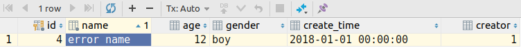

[TOC]
#### 什么是触发器
触发器，顾名思义是在触发了某个动作之后而执行的一串数据库脚本。主要是用在数据的增、删、改动作之上。触发器的执行是自动的，只要触发器中监听的动作发生了触发器就会自动执行。
#### 触发器的定义

	DROP TRIGGER IF EXISTS triggerName; -- just for update trigger
	CREATE TRIGGER triggerName BEFORE UPDATE
	  ON tableName FOR EACH ROW
	  BEGIN 
	  	-- to do something
	  END;

#### 触发器中的BEFORE 和 AFTER
BEFORE：(INSERT、UPDATE)可以对NEW中的数据进行拦截**修改**，
AFTER：不能对NEW进行修改。
两者都不能修改OLD（**只读**）数据，但是可以获取到OLD中的数据。即，触发器不能修改原来表中的数据。

	DELIMITER $$
	DROP TRIGGER IF EXISTS updateTrigger;
	CREATE TRIGGER updateTrigger BEFORE UPDATE ON user FOR EACH ROW
	    BEGIN
		DECLARE oldName VARCHAR(20);
		DECLARE newName VARCHAR(20);
		-- 测试更新操作之前能否对拿到OLD和NEW的虚拟表对象
		SET newName = NEW.name;
		SET oldName = OLD.name;
		IF newName IS NOT NULL AND oldName IS NOT NULL THEN
		    SET NEW .name = "error name";
		END IF;
	    END $$

	DELIMITER ;

	-- 验证
	UPDATE user SET name = "zhangsan" WHERE id = 4;
	-- 查看结果
	SELECT * FROM user WHERE id = 4;

**实例：**

	-- 对user表中插入前的数据进行拦截修改用户名为大写
	DELIMITER $$
	DROP TRIGGER IF EXISTS nameToUpperCase;

	CREATE TRIGGER nameToUpperCase BEFORE INSERT ON user FOR EACH ROW
	    BEGIN
		DECLARE upperName VARCHAR(20);
		/*
		对于insert 操作，只能修改插入的数据，而不能对数据库中原来的数据进行修改。
		即：只能操作NEW对象，不能操作OLD对象
		*/
		SET upperName = NEW.name;
		SELECT upper(upperName) INTO upperName;
		SET NEW.name = upperName;
	    END $$

	DELIMITER ;

	-- 向表中插入数据
	INSERT INTO user (name, age, gender, creator, create_time) VALUES ("lowwer", 22, "boy", 1, sysdate());

	-- 查询结果
	SELECT * FROM user WHERE age = 22;

**总结：**	
AFTER：是在记录操纵之后触发，是先完成数据的增删改，再触发，触发的语句晚于监视的增删改操作，无法影响前面的增删改动作
BEFORE：是在记录操纵之前触发，是先完成触发，再增删改，触发的语句先于监视的增删改，我们就有机会判断，修改即将发生的操作，如：我们在触发之前需要判断new值和old值的大小或关系，如果满足要求就触发，不通过就修改再触发；如：表之间定义的有外键，在删除主键时，必须要先删除外键表，这时就有先后之分，这里before相当于设置了断点，我们可以处理删除外键。

#### 触发器中的NEW 和 OLD
- INSERT语句, 只有NEW是合法的，因为是新添加数据；
- DELETE语句，只有OLD才合法，因为没有新数据可以操作；
- UPDATE语句，NEW、OLD可以同时使用。

		DELIMITER $$
		DROP TRIGGER IF EXISTS deleteTrigger;
		CREATE TRIGGER deleteTrigger AFTER DELETE ON user FOR EACH ROW
		    BEGIN
			/*
			DELETE 触发器在 DELETE 语句执行之前或之后执行。需要知道以下两点：
			1.在 DELETE 触发器代码内，你可以引用一个名为 OLD 的虚拟表，访问被删除的行；
			2.OLD 中的值全都是只读的，不能更新。下面的例子演示使用 OLD 保存将要被删除的行到一个存档表中：
			*/
			IF OLD.id = 2 THEN
			    -- 触发器不能在监控增删改的时候再更改同一张表
			    INSERT INTO course(name, teacher, type) VALUES ("自然", "王小英", 1);
			END IF;
		    END $$
		DELIMITER ;

		DELETE FROM user WHERE id = 2;
		