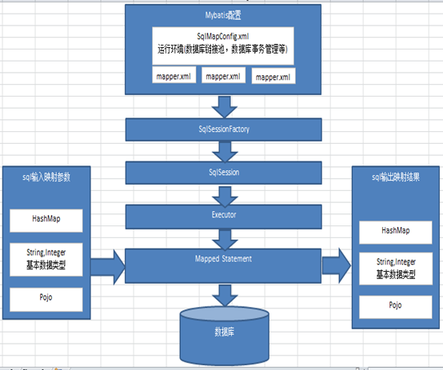
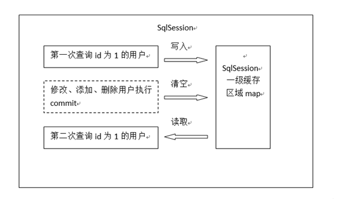
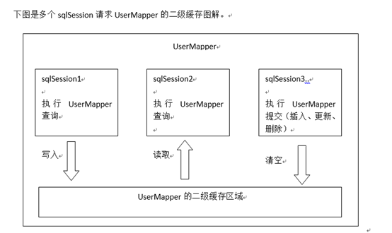

#### 什么是Mybatis
&emsp;&emsp;Mybatis是对JDBC封装的优秀的数据持久层框架,让我们在开发中只关注SQL的封装,而不必关注其他事情

#### Mybatis总体架构图

**SqlMapConfig.xml:**
&emsp;&emsp;此文件作为Mybatis的全局配置文件,配置了Mybatis的运行环境等等
**mapper.xml:**
&emsp;&emsp;配置了一些sql语句,需要在SqlMapConfig.xml中进行加载
**SqlSessionFactory:**
&emsp;&emsp;Mybatis的绘画工厂,由SqlMapConfig进行创建
**sqlSession:**
&emsp;&emsp;操作数据库的基本单元,由绘画工厂创建
**Excuter:**
&emsp;&emsp;Mybatis底层定义了执行器Excuter操作数据库,Excuter的实现有两个,一个是基本执行器,一个是缓存执行器
**Mapped Statment:**
&emsp;&emsp;Mapped Statment也是Mybatis的一个底层对象,包括了Mybatis的配置信息和Sql映射信息,Mapper.xml一个sql对应一个statment
&emsp;&emsp;mapped Statmet对输入的参数映射到sql语句中叫做输入映射
&emsp;&emsp;mapped Statment负责将查询出来的结果集映射到java对象中,叫做输出映射

#### Mybatis与Hibernat的区别:
&emsp;&emsp;Mybatis是一个不完全的ORM框架,它注重的是对SQL的封装,要求程序员进行配置SQL,并将java对象和SQL之间进行输入和输出映射, 而Hibernat是一个完全的ORM框架,它关心的是表和对象之间的映射关系
&emsp;&emsp;Mybatis比较轻便,易于上手,而Hibernat的学习成本比较大,需要精通更难

#### Mapper代理方式开发DAO
&emsp;&emsp;Mapper.xml文件中的namespace与mapper接口的类路径相同。
&emsp;&emsp;Mapper接口方法名和Mapper.xml中定义的每个statement的id相同
&emsp;&emsp;Mapper接口方法的输入参数类型和mapper.xml中定义的每个sql 的parameterType的类型相同
&emsp;&emsp;Mapper接口方法的输出参数类型和mapper.xml中定义的每个sql的resultType的类型相同

#### Mybatis的一级缓存

 &emsp;&emsp;一级缓存区域是根据SqlSession为单位划分的Mybatis内部存储缓存使用一个HashMap，每个sqlSession对象使用一个map存储缓存数据，map的key唯一标识一个sql语句，key对应的value是从数据库查询出来数据映射生成的java对象。 sqlSession执行insert、update、delete等操作commit提交后会清空缓存区域。
#### Mybatis的二级缓存

 &emsp;&emsp;二级缓存区域是根据mapper的namespace划分的，相同namespace的mapper查询数据放在同一个区域，如果使用mapper代理方法每个mapper的namespace都不同，此时可以理解
 &emsp;&emsp;为二级缓存区域是根据mapper划分。
 &emsp;&emsp;每次查询会先从缓存区域找，如果找不到从数据库查询，查询到数据将数据写入缓存。Mybatis内部存储缓存使用一个HashMap，每个mapper映射文件(以namespace为单位)对应一个map，
 &emsp;&emsp;map的key唯一标识一个sql语句，key对应的value是从数据查询出来数据映射生成的java对象。
 &emsp;&emsp;sqlSession执行insert、update、delete等操作commit提交后会清空缓存区域

**Mybatis二级缓存的局限性**
 &emsp;&emsp;mybatis二级缓存对细粒度的数据级别的缓存实现不好，比如如下需求：对商品信息进行缓存，由于商品信息查询访问量大，但是要求用户每次都能查询最新的商品信息，此时如果使用mybatis
 &emsp;&emsp;的二级缓存就无法实现当一个商品变化时只刷新该商品的缓存信息而不刷新其它商品的信息，因为mybaits的二级缓存区域以mapper为单位划分，当一个商品信息变化会将所有商品信息的缓存数
 &emsp;&emsp;据全部清空。解决此类问题需要在业务层根据需求对数据有针对性缓存。比如业务层使用redis服务器进行缓存技术
 
**${} 和#{}有什么区别**

 &emsp;&emsp;${}表示一个sql拼接符号
 &emsp;&emsp;是在向数据库发出sql语句之前去拼接好sql在提交给数据库执行
 &emsp;&emsp;#{}将整个参数和sql语句两部分提交给数据库，数据库去执行sql语句，去表中匹配所有的记录是否和整个参数是否一致
