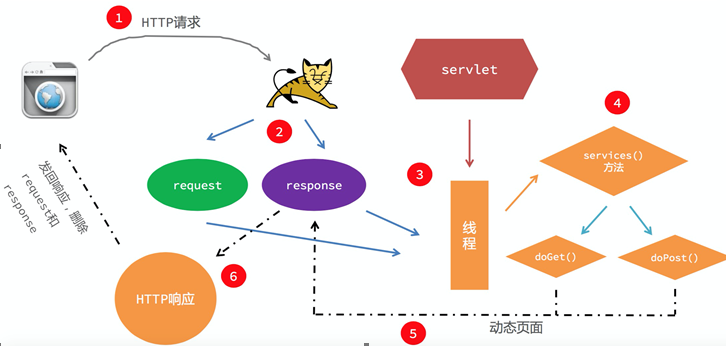

#### Servlet是什么,有什么作用
Servlet是SUN公司推出的一套规范,规定了如何使用java开发动态网站.是运行在java服务器端的小程序.Servlet在API中的表现形式是一个接口，其继承的子类有GenericServlet,而HTTPServlet又继承了GenericServlet。

#### 什么是ServletContext,由谁创建
ServletContext表示Servlet的上下文对象,当启动服务器的时候,会加载web.xml读取里面所配置的监听器和过滤器还有一些其他配置,将其加载到内存中,ServletContext就代表了这个WEB应用,当关闭服务器的时候,会卸载ServletContext。

#### ServletRequest和ServletResponse的生命周期
我们HTTP请求是基于请求与响应的,当我们访问Servlet的时候,WEB服务器会给我们创建request与response对象,request对象中封装了请求相关的一些信息,而response中封装了响应相关的一些信息,当我们执行完一次操作之后,response返回结果,此时request和response也就销毁。

#### Servlet是线程安全的吗?如何实现线程安全
Servlet是线程不安全的,它是单利模式,当我们每次请求访问的时候,都会创建一个新的线程
实现Servlet线程安全的方案:
1.实现SingleThreadModel接口
2.进行加锁处理,保证线程的安全 
          
	Public class XXX extends HttpServlet { 
		......
		synchronized (this){
			......
		}
	}
3.线程的安全隐患还是因为全局变量引起的,我们避免使用全局变量会使得线程安全

#### Tomcat是怎么处理请求的

#### 响应重定向和请求转发的区别
1.响应重定向是客户端行为,请求转发是服务器端行为
2.响应重定向是多次请求多次响应,请求转发是一次请求一次响应
3.响应重定向可以访问站外资源,请求转发只能访问站内资源

#### HTTP请求的GET和POST请求的区别
1.GET请求是通过请求行来携带参数的,参数显示在地址栏POST是在请求体携带请求参数,地址栏不会携带参数
2.GET请求会调用服务器端的doGET方法处理,POST请求调用服务器端的doPOST方法处理请求
3.GET请求对请求的数据有大小的限制(2K),数据不安全,POST请求对请求参数的大小无限制,安全