#### 认识springboot

**Springboot的发展趋势**

Springboot是spring的增强版,是下一代的框架
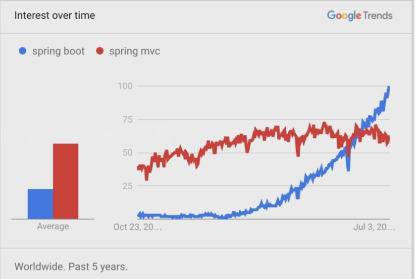
#### 搭建springboot的入门程序

**创建工程**
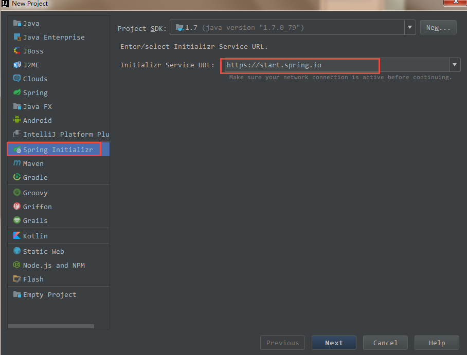
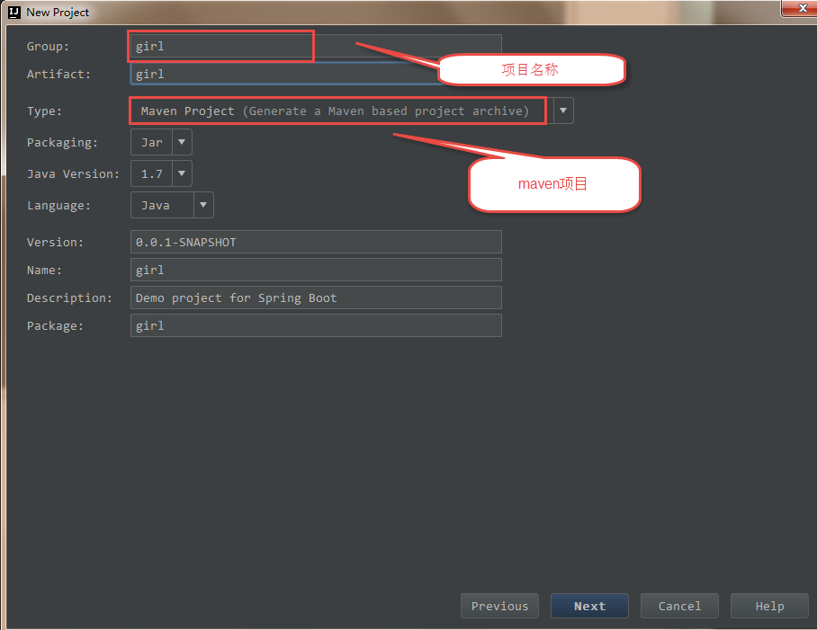
Springboot版本号
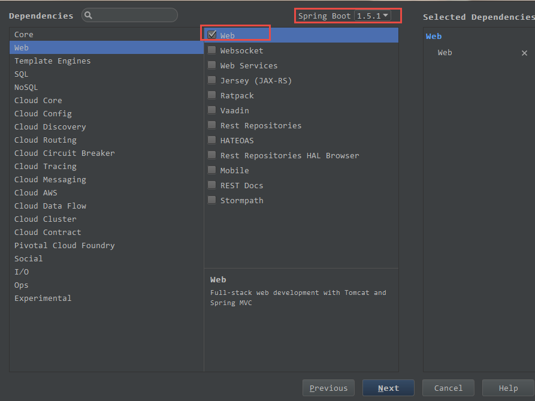
项目存储路径
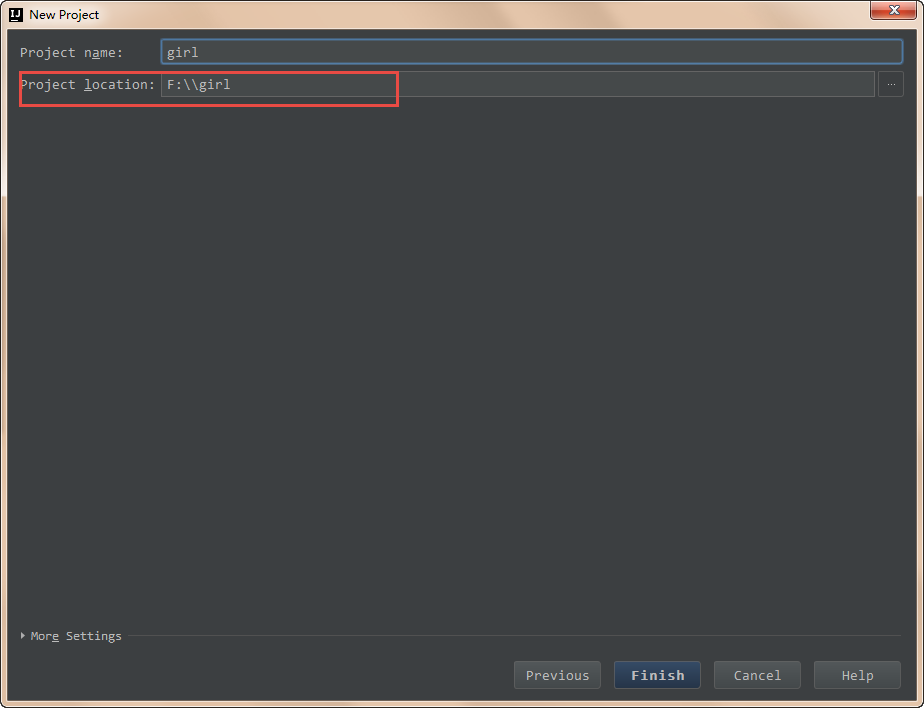
删除三个文件
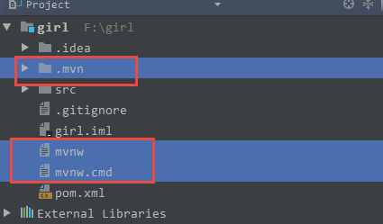
Pom文件中的springboot的依赖
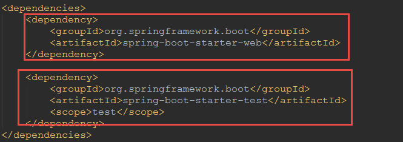
右键点击运行
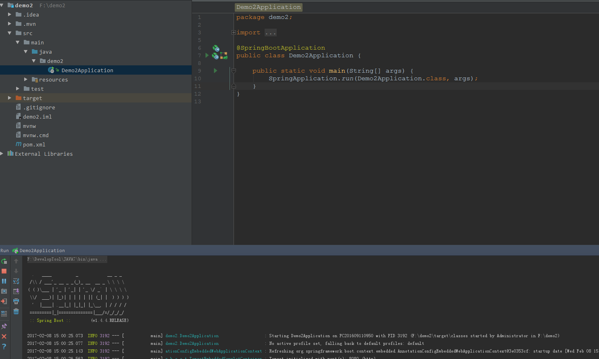
编写一个入门程序
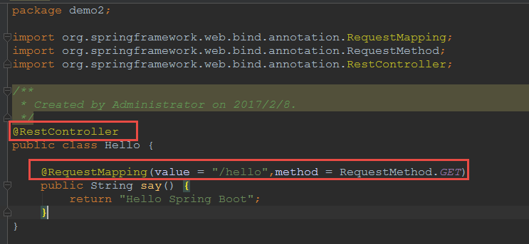
启动程序访问浏览器
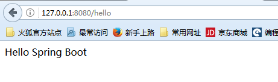
#### 第一种项目的配置文件application.properties
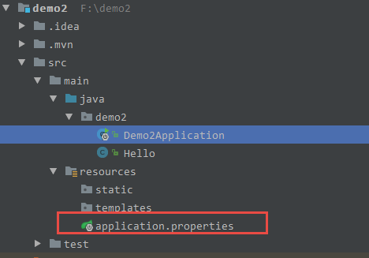
**配置文件的配置说明**

springBoot项目默认端口号是8080,配置端口号:
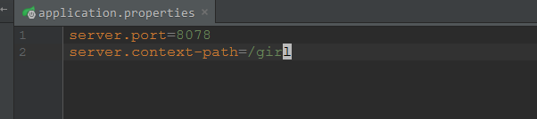
启动访问浏览器
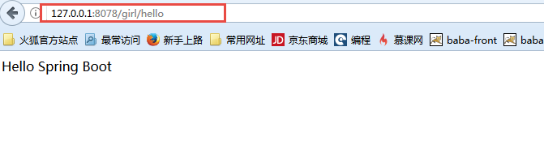
#### 第二种项目配置文件的方式yml的方式
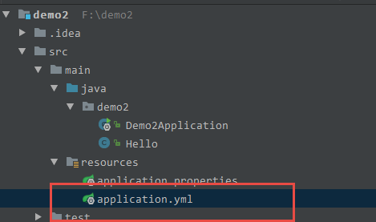
浏览器访问
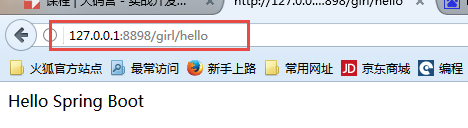
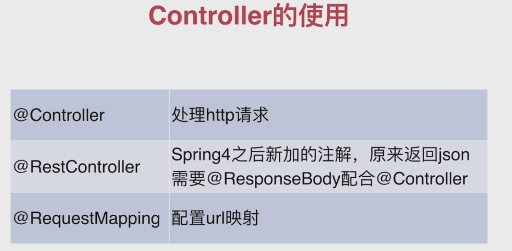
#### 配置多个路径映射
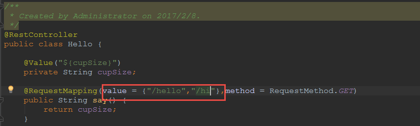
#### 当使用rest风格的请求路径的时候获取请求参数
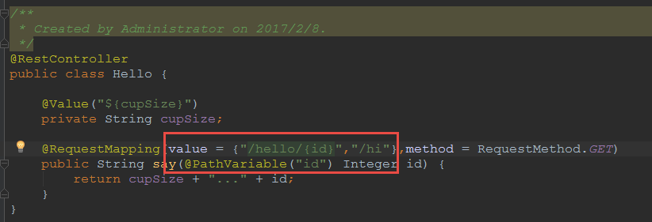
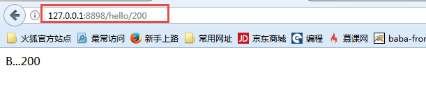
#### 当时用传统请求时获取请求参数
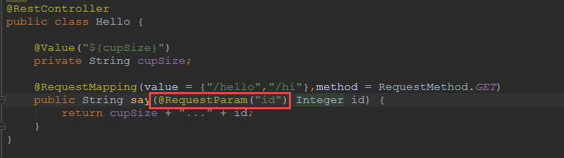

