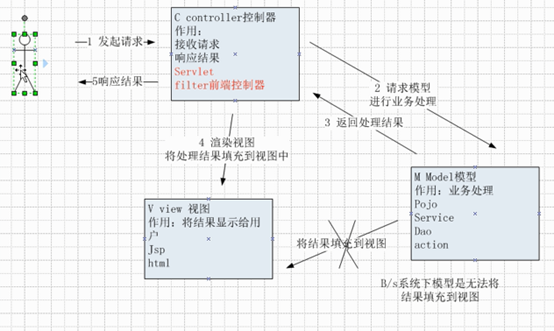
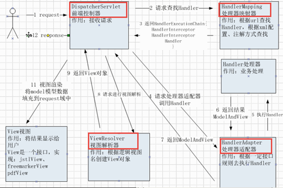
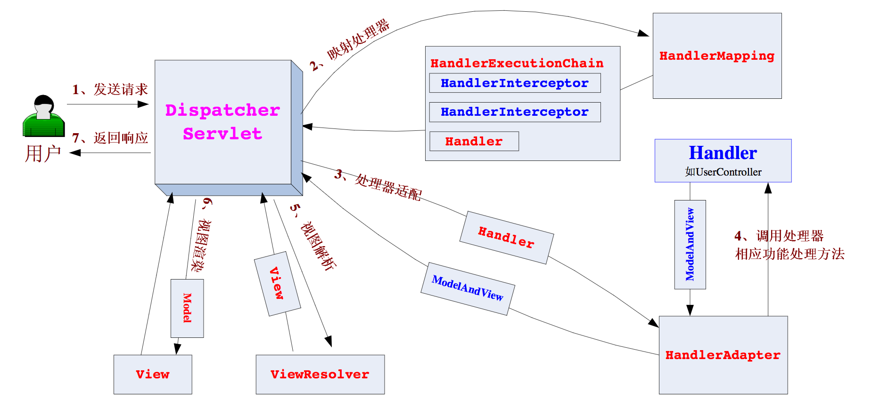

#### 什么是Springmvc
&emsp;&emsp;Springmvc是表现层(web层)的一个MVC框架,是Spring的一部分

#### Springmvc在B/S中的架构图

#### Springmvc的架构图

#### Springmvc怎么处理返回值
&emsp;&emsp;封装为ModelAndView或者直接返回字符串
#### Springmvc,Struts2,Strruts1的入口分别是什么
&emsp;&emsp;Springmvc是DispatcherServlet,Struts2是strutsPrepareAndExcutFilter,Struts1是ActionServlet

#### Struts2与Springmvc的区别
&emsp;&emsp;1.Struts2前端控制器是一个Filter,Springmvc的前端控制器是一个Servlet
&emsp;&emsp;2.Struts2用成员变量接收参数,所以是多例模式的,Springmvc用形式参数进行参数绑定,所以是单利的
&emsp;&emsp;3.Struts2存取值是通过值栈和OGNL表达式,Springmvc是进行参数绑定
&emsp;&emsp;4.Struts2是基于类进行开发的,Springmvc是基于方法进行开发的

#### 前端框架有了Struts2为什么还需要Springmvc
&emsp;&emsp;1.从运行效率上来讲,Struts2和Springmvc是没有多大差异的,只是Springmvc比Struts2开发效率要高
&emsp;&emsp;2.struts2在开发的历程中暴露出来了一些安全性的问题
&emsp;&emsp;3.struts2和springmvc并没有什么相对的概念,就好比有了百事可乐,可口可乐也依然存在一样,两者并不矛盾