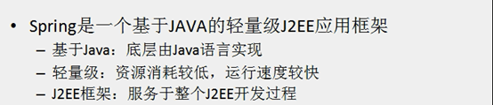
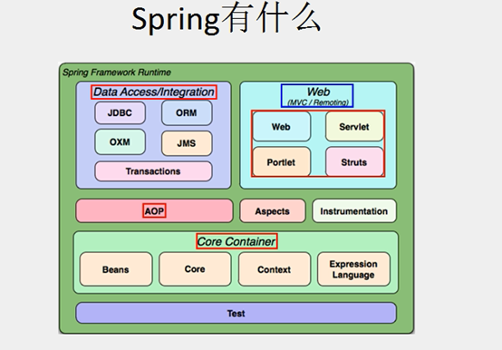
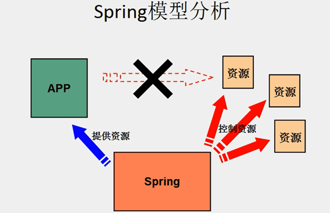
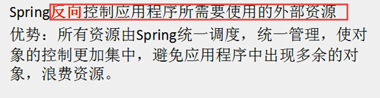
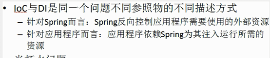
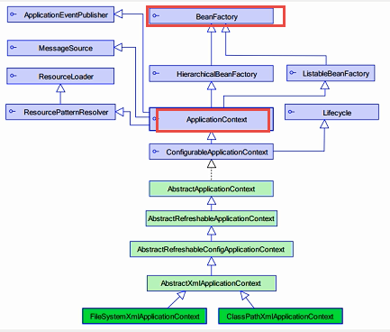
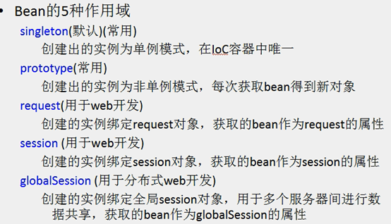
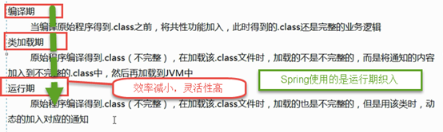
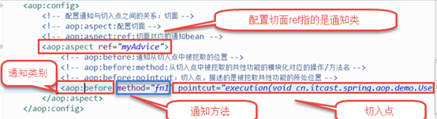
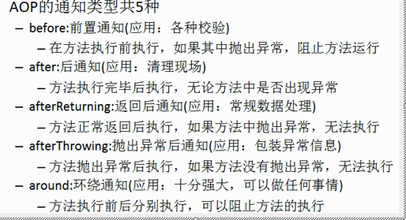

#### 什么是Spring

#### Spring控制反转IOC

#### Spring的依赖注入DI
&emsp;&emsp;应用程序依赖Spring为其注入资源叫做依赖注入.当Spring为Bean注入属性的时候，基本数据类型，基本数据类型包装类，String用的是value，其他的引用数据类型用的是ref
#### IOC和DI之间的关系

#### ApplicationContex与BeanFactory之间的关系
&emsp;&emsp;getBean方法其实是在BeanFactory中,applicationContext初始化Bean的对象默认情况下是立即加载，
&emsp;&emsp;BeanFactory初始化Bean默认的情况下是延迟加载，只有用到Bean的时候才会初始化对象.applicationContext是BeanFactory的子接口,功能比BeanFactory更加强大

#### Spring中Bean的初始化
1.构造器初始化,需要一个无参数的构造器
2.静态工厂初始化

	<bean factory-method=”” class=””></bean>
3.实例工厂初始化

	<bean factory-method=”” factory-bean=””></bean>

#### Spring创建出对象的五种状态（Scope属性）

#### Spring中Bean的生命周期
&emsp;&emsp;如果Bean是单利的（Spring默认的配置方式），则只初始化初始化一次，不会消亡，只有当Spring的IOC容器关闭的时候才会销毁Bean对象
如果Bean是非单利的，则Bean对象不由Spring的IOC容器管理，由JVM的垃圾回收机制收回，创建的时候，每次使用都会创建一个新的对象

#### Spring的属性注入
&emsp;&emsp;Autowired默认是按照类型进行注入的
当Autowired + Qualifier(“name”) 是按照名称进行注入，其中name必须写

#### 面向切面编程AOP理解
&emsp;&emsp;AOP是一种编程范式，由AOP联盟提出用来弥补oop的不足。传统的oop关注的是纵向编程，而AOP关注的是将同一层面上共性的部分抽取出来形成独立的模块，
&emsp;&emsp;在程序的执行阶段又动态的添加进去，组成完整的业务代码。

#### AOP的基本概念
**目标类:**
&emsp;&emsp;需要被增强的类（原始类）叫做目标类，由目标类创建的对象叫做目标对象
**连接点:**
&emsp;&emsp;目标类中所有的方法（的执行）叫做连接点
**切入点:**
&emsp;&emsp;目标类中具有共性功能的方法（的执行）叫做切入点
**通知:**
&emsp;&emsp;将共性功能抽取到一个类中叫做通知类，共性模块叫做通知
**AOP代理:**
&emsp;&emsp;抽取后的类创建的对象不能在完成相应的功能，这时候就需要创建一个AOP代理对象完成完整的业务功能，创建AOP代理对象的过程叫做AOP代理
**织入:**
&emsp;&emsp;将增强的共性功能添加到切入点的过程叫做织入
**织入的时机:**

**切面:**
&emsp;&emsp;通知和切入点之间的对应关系叫做切面（从数学的角度点与点之间的连线形成线，多条线形成面

#### 面向切面配置

#### AOP通知的5种类型

