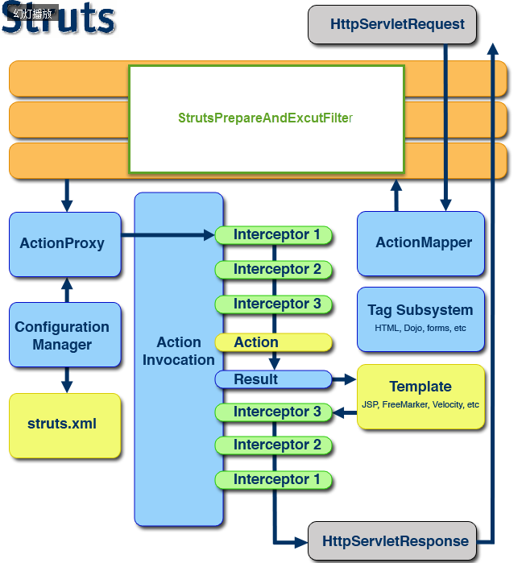

#### Struts2执行流程:

	1.客户端发送HTTP请求到前端控制器StrutsPrepareAndExcetFilter,前端控制器看是不是Action
	2.如果是不是Action放行,如果是Action则查找ActionMapper,返回前端控制器
	3.前端控制器创建ActionProxy
	4.经过Action Invocation管理的一堆拦截器后代理对象执行Action,
	5.将执行结果返回模板(JSP.Freemarker),渲染视图,返回客户端

#### Struts2是如何启动的
          Struts2是通过StrutsPrepareAndExcutFilter进行启动的,当我们开启服务器的时候,前端控制器会执行,从而执行init方法.此方法中会加载struts.xml
          配置文件,读取配置的Bean在内存中,当以后再需要Bean的时候从内存中读取

#### Struts-default默认包的作用
	Struts-default默认包是Struts2中内置的,内部定义了许多的拦截器,比如参数封装,模型驱动,文件上传.Struts-deult包是在Striuts-default.xml中定义,Struts-defalut.xml
	中不仅仅定义了一堆有用的拦截器,还定义了结果类型,拦截器栈,一般我们的package都要继承struts-default包

#### Struts2是单利的吗
	Struts2不是单利的,每个请求都会产生一个实例,类级别的线程安全

#### Struts2如何访问Servlet API
	1.通过ActionContext获取三个域对象,request,session,application
	2.通过ActionContext的子类ServletActionContext
	3.通过ServletAware一些接口获取

#### Struts2中常见的拦截器
	  ModelDriven,FileUpload,parameters,Session,TockSession,Exception,validator

#### Struts2常见的几种结果类型
	dispatcher:转发到jsp(默认)
	chain:转发到Action
	redirect:重定向到jsp
	redisrectAction:重定向到Action
	stream:流