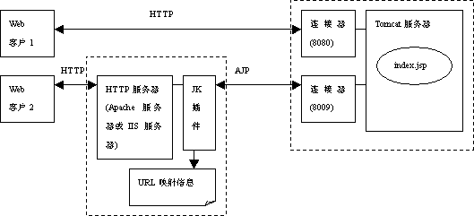

#### Tomcat 端口配置，及原理详解

如果想深入了解tomcat的各个端口及配置，建议通读文章，对初学者十分有利，整理自网络。

Tomcat服务器需配置三个端口才能启动，安装时默认启用了这三个端口，当要运行多个tomcat服务时需要修改这三个端口，不能相同。端口配置路径为tomcat\ conf\service.xml

修改Shutdown端口（默认为8005端口）
```
<Server port="8005" shutdown="SHUTDOWN">
```

修改http访问端口（默认为8080端口） 
负责建立HTTP连接。在通过浏览器访问Tomcat服务器的Web应用时，使用的就是这个连接器。
``` 
<Connector port="8080" protocol="HTTP/1.1" connectionTimeout="20000" redirectPort="8443" /><!-- A "Connector" using the shared thread pool--><!-- <Connector executor="tomcatThreadPool" port="8080" protocol="HTTP/1.1" connectionTimeout="20000" redirectPort="8443" />
```
AJP协议访问端口（默认为8009端口） 
负责和其他的HTTP服务器建立连接。在把Tomcat与其他HTTP服务器集成时，就需要用到这个连接器。

```
<!-- Define an AJP 1.3 Connector on port 8009 --><Connector port="8009" protocol="AJP/1.3" redirectPort="8443" />
```
Web客户访问Tomcat服务器上JSP组件的两种方式如图所示。

