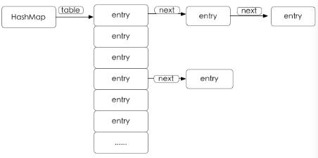

**hashmap的数据结构**是由数组和链表来实现，但这两种数据结构基本上是两个极端。
**数组**：数组存储区间是连续的，占用内存严重，故空间复杂的很大。但数组的二分查找时间复杂度小，为O(1)；数组的特点是：寻址容易，插入和删除困难；
**链表**：链表存储区间离散，占用内存比较宽松，故空间复杂度很小，但时间复杂度很大，达O（N）。链表的特点是：寻址困难，插入和删除容易。哈希表那么我们能不能综合两者的特性，做出一种寻址容易，插入删除也容易的数据结构？答案是肯定的，这就是我们要提起的哈希表。哈希表（(Hash table）既满足了数据的查找方便，同时不占用太多的内容空间，使用也十分方便。哈希表有多种不同的实现方法，我接下来解释的是最常用的一种方法—— 拉链法，我们可以理解为“链表的数组” ，如图：

从上图我们可以发现哈希表是由【数组+链表】组成的，一个长度为16的数组中，每个元素存储的是一个链表的头结点。那么这些元素是按照什么样的规则存储到数组中呢？一般情况是通过【hash(key)%len】获得，也就是元素的key的哈希值对数组长度取模得到。比如上述哈希表中，12%16=12,28%16=12,108%16=12,140%16=12。所以12、28、108以及140都存储在数组下标为12的位置。HashMap也可以理解为其存储数据的容器就是一个【线性数组】。这可能让我们很不解，一个线性的数组怎么实现按键值对来存取数据呢？这里HashMap有做一些处理。首先HashMap里面实现一个静态内部类Entry，其重要的属性有 key , value, next。从属性key,value我们就能很明显的看出来Entry就是HashMap键值对实现的一个基础bean，我们上面说到HashMap的基础就是一个线性数组，这个数组就是Entry[]，Map里面的内容都保存在Entry[]里面。/** The table, resized as necessary. Length MUST Always be a power of two. */transient Entry[] table;

存储逻辑: 
既然是线性数组，为什么能随机存取？这里HashMap用了一个小算法，大致是这样实现：
//存储时:
int hash = key.hashCode(); // 每个key的hash是一个固定的int值int index = hash % Entry[].length;// 去模运算，运算后的值肯定在0-length之间Entry[index] = value;// 以去模后的值为索引，把value存进去疑问：如果两个key通过hash%Entry[].length得到的index相同，会不会有覆盖的危险？这里HashMap里面用到链式数据结构的一个概念。上面我们提到过Entry类里面有一个next属性，作用是指向下一个Entry。打个比方， 第一个键值对A进来，通过计算其key的hash得到的index=0，记做:Entry[0] = A。一会后又进来一个键值对B，通过计算其index也等于0，现在怎么办？HashMap会这样做:B.next = A,Entry[0] = B。如果又进来C,index也等于0,那么C.next = B,Entry[0] = C；这样我们发现index=0的地方其实存取了A,B,C三个键值对,他们通过next这个属性链接在一起。

	public V put(K key, V value) {
		 if (key == null) {
		 	return putForNullKey(value); //null总是放在数组的第一个链表中 
		 }
		 int hash = hash(key.hashCode());
		 int i = indexFor(hash, table.length);        //遍历链表
		 for (Entry<K, V> e = table[i]; e != null; e = e.next) {
			 Object k;            //如果key在链表中已存在，则替换为新value（不要误解为是用新的值把旧的值覆盖了！）
			  if (e.hash == hash && ((k = e.key) == key || key.equals(k))){
				  V oldValue = e.value;
				  e.value = value;
				  e.recordAccess(this);
				  return oldValue;
			  }
		  }
		  modCount++;
		  addEntry(hash, key, value, i);
		  return null;
	}
	
	void addEntry(int hash, K key, V value, intO(∩_∩)O bucketIndex) {
		Entry<K, V> e = table[bucketIndex];
		table[bucketIndex] = new Entry<K, V>(hash, key, value, e); //参数e, 是Entry.next
		//如果size超过threshold，则扩充table大小。再散列
		if (size++ >= threshold) resize(2 * table.length);
	}
   
   
   当然HashMap里面也包含一些优化方面的实现，比如：Entry[]的长度一定后，随着map里面数据的越来越长，这样同一个index的链就会很长，会不会影响性能？HashMap里面设置一个因子，随着map的size越来越大，Entry[]会以一定的规则加长长度。
  
  
  
  
  