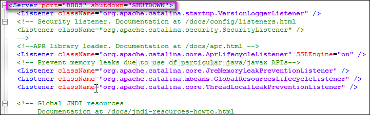
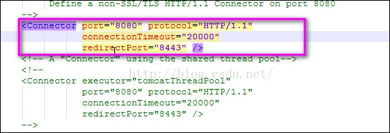
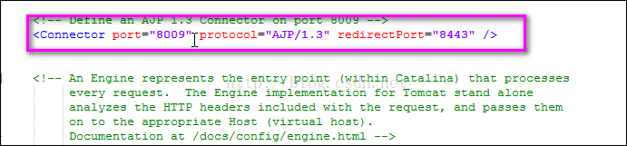

1. 服务器关闭监听端口：

	详解：
	
		　　port:指定一个端口，这个端口负责监听关闭Tomcat的请求
		　　当执行shutdown.sh的时候会向以上端口发送的关闭服务器的命令字符串

2. 服务器请求监听端口：

	详解：

		　　port:服务器连接器的端口号,该连接器将在指定端口侦听来自客户端的请求。
		　　redirectPort:服务器正在处理http请求时收到了一个SSL传输请求后重定向的端口号。
		　　connectionTimeout:等待超时的时间数（以毫秒为单位）。

3. AJP请求监听端口：

	详解：
	
		　　AJP协议访问端口（默认为8009端口） 
		　　负责和其他的HTTP服务器建立连接。在把Tomcat与其他HTTP服务器集成时，就需要用到这个连接器。